

The app was made for Software Development Project (CS-306) at EPFL

# Eventum

Eventum is an app created to streamline the process of creating and attending events.

## Table of content

  - [Table of content](#table-of-content)
  - [Swipe](#swipe)
  - [Filter](#filter)
  - [Map](#map)
  - [Sidebar](#sidebar)
  - [Attending list](#attending-list)
  - [Event info](#event-info)
  - [Leave an event](#leave-an-event)
  - [Create](#create)
  - [User profile](#user-profile)
  - [Creators](#creators)

## Swipe

You can swipe left or right to deny or accept an event, respectively, and find out more about an event by clicking on it.

## Filter

Use this menu to filter events by distance and category.

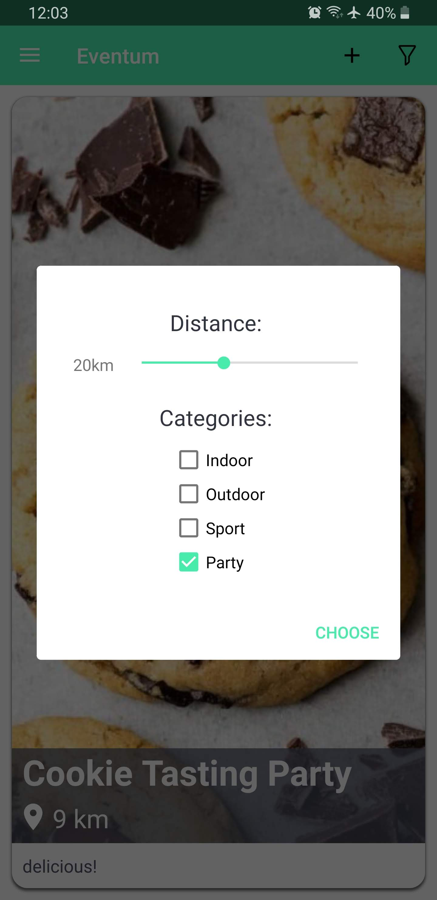

## Map

You can also display a map that shows you nearby events. Click on any red marker to see a quick description of the event and a photo, and clicking on that pop-up gives you the option to accept or deny that event.

 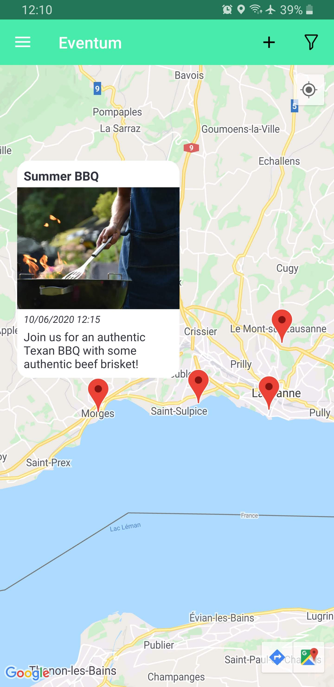

## Sidebar

Easily navigate through the app using the navigation menu, accessed by clicking on the top left icon

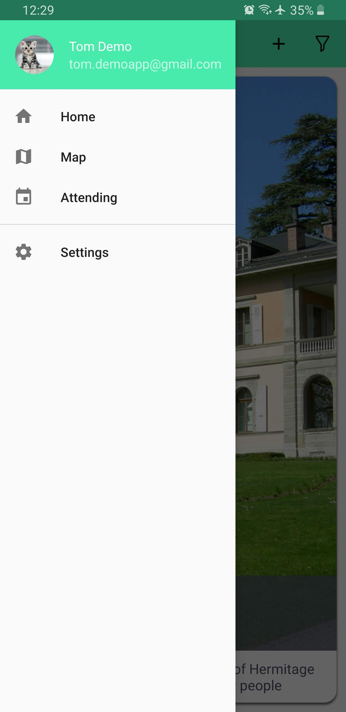

## Attending list

 Access all the events you accepted, and get informed about when they are happening using the attending list.

 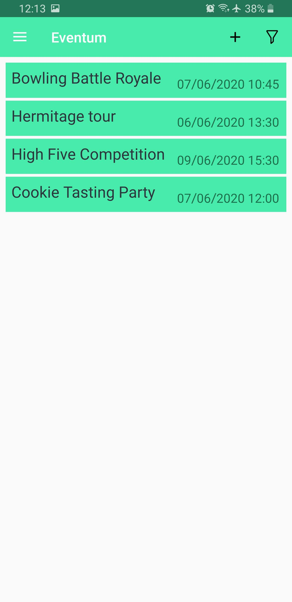

## Event info

Accessing an event from the attending list gives you access to extra information and functionalities related to that event, such as:
   * Date & time
   * Location (with an integrated minimap)
   * Weather forecast at the time and location of the event
   * List of people attending that event
   * Link sharing
   * Chat
   * Calendar integration

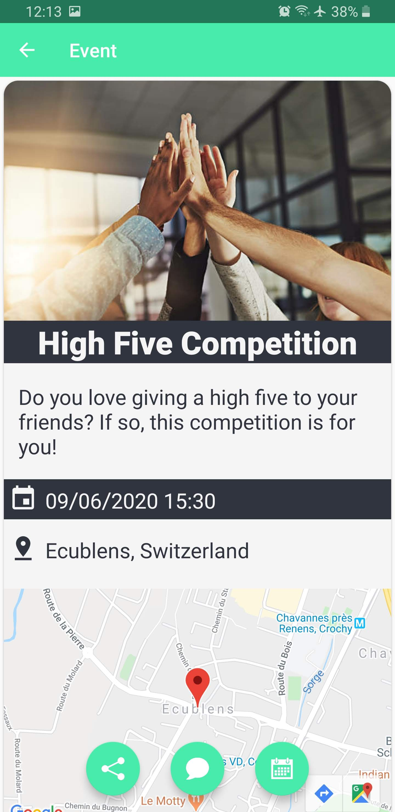

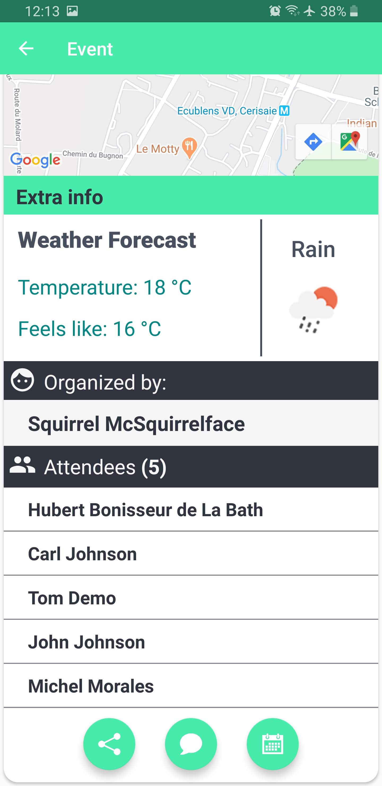

#### Chat

* Chat with all other attendees:

   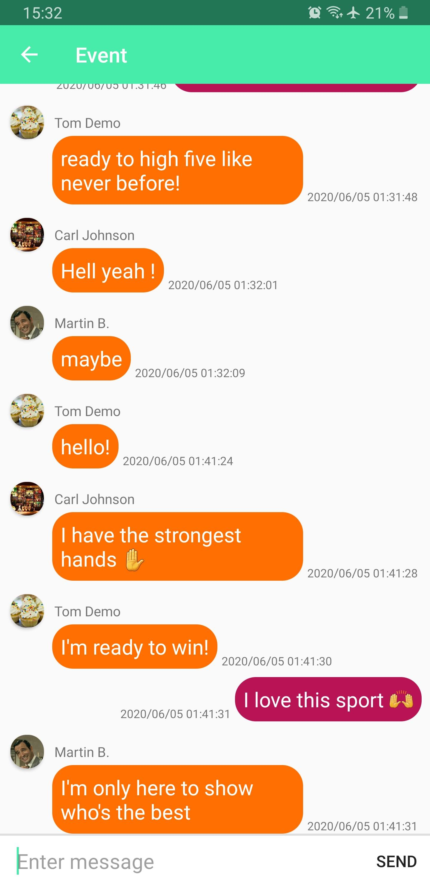

#### Attendee Profile

 * You can check out other people's profile by clicking on their name:

    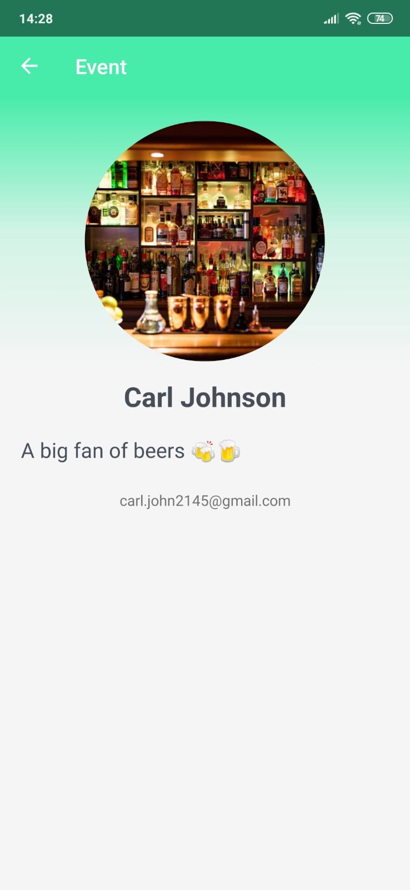

## Leave an event

If you change your mind after attending an event, you can always remove it from your attending list by swiping left on it:

 

## Create

Creating an event is a breeze with Eventum. Start by clicking on the **+** icon on the top right corner, and you will access our event creation menu. Simply add a title, description, date and time, address, categories and a picture and your event will be visible to any user of the Eventum app.

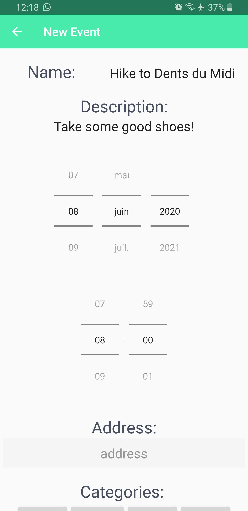

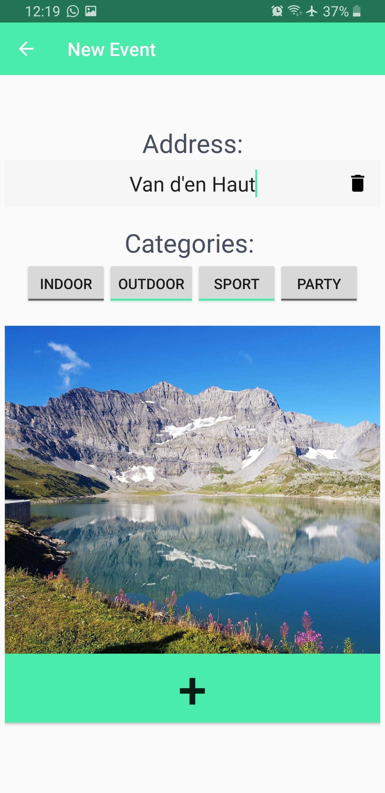

## User profile

By clicking on your profile name on the sidebar, you get access to your personal page. Here, you can change your profile picture, add a short bio and access all the events that you created.

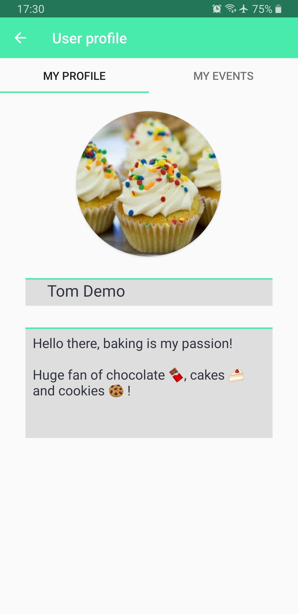

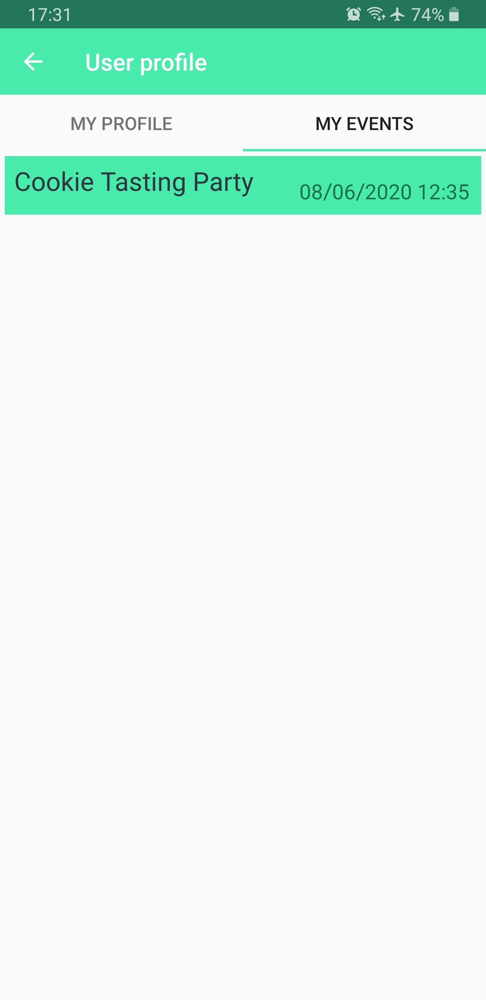

## Creators

* Corentin Bugnot
* David Mizrahi
* Dorian Ros
* Jonatan Bonjour
* Karim Sabaa
* Martin Beaussart
* Michel Morales
